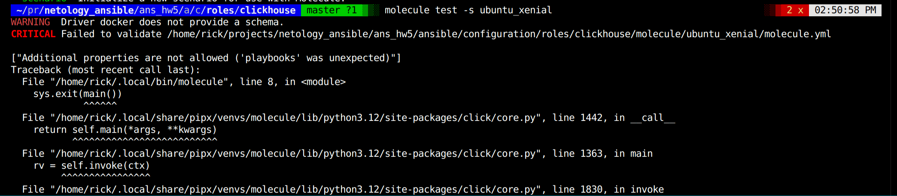
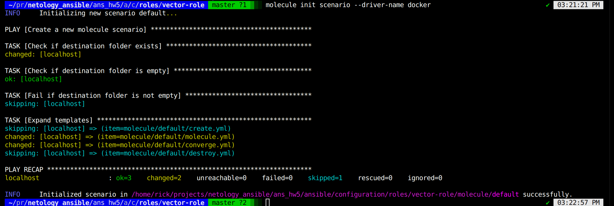
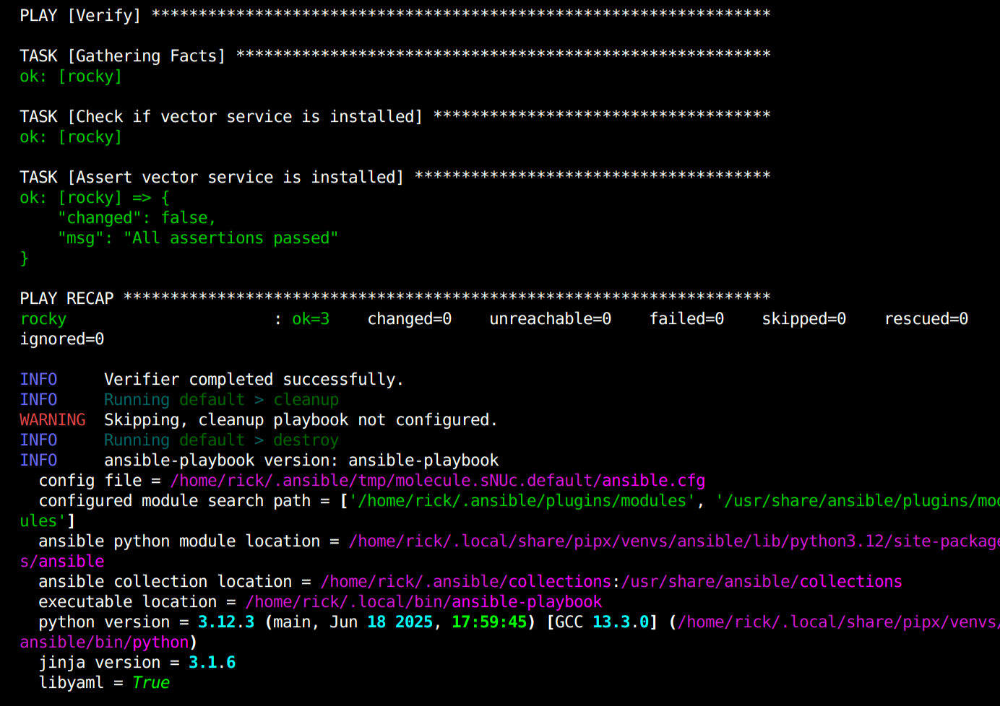
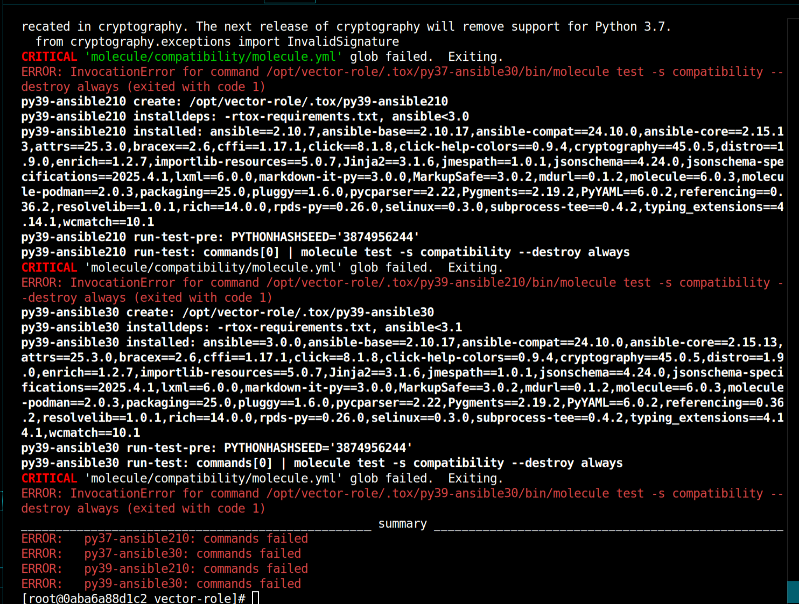

molecule:

tox:
да ну сколько можно эту домашку вилкой от ошибок чистить(((((

что-то фиксил фиксил, по итогу дошел до следующей проблемы, в инете нашел по ней следующий коммент:
"при запуске podman внутри docker-контейнера (или на хосте без поддержки cgroup v2).
Molecule с драйвером podman требует полноценной поддержки cgroup и user namespaces, что часто не работает в docker-in-docker или на старых ядрах/дистрибутивах."

Логи:
PLAY [Create] ******************************************************************

TASK [get podman executable path] **********************************************
/usr/local/lib/python3.6/site-packages/ansible/parsing/vault/__init__.py:44: CryptographyDeprecationWarning: Python 3.6 is no longer supported by the Python core team. Therefore, support for it is deprecated in cryptography. The next release of cryptography will remove support for Python 3.6.
  from cryptography.exceptions import InvalidSignature
ok: [localhost]

TASK [save path to executable as fact] *****************************************
ok: [localhost]

TASK [Log into a container registry] *******************************************
skipping: [localhost] => (item="instance registry username: None specified")

TASK [Check presence of custom Dockerfiles] ************************************
ok: [localhost] => (item=Dockerfile: None specified)

TASK [Create Dockerfiles from image names] *************************************
changed: [localhost] => (item="Dockerfile: None specified; Image: docker.io/centos:8")

TASK [Discover local Podman images] ********************************************
ok: [localhost] => (item=instance)

TASK [Build an Ansible compatible image] ***************************************
FAILED - RETRYING: Build an Ansible compatible image (3 retries left).
FAILED - RETRYING: Build an Ansible compatible image (2 retries left).
FAILED - RETRYING: Build an Ansible compatible image (1 retries left).
failed: [localhost] (item=docker.io/centos:8) => {"ansible_loop_var": "item", "attempts": 3, "changed": true, "cmd": ["/usr/bin/podman", "build", "-f", "/root/.cache/molecule/vector-role/podman/Dockerfile_docker_io_centos_8", "-t", "molecule_local/docker.io/centos:8"], "delta": "0:00:05.268474", "end": "2025-07-15 17:48:23.128583", "item": {"ansible_index_var": "i", "ansible_loop_var": "item", "changed": true, "checksum": "5244995fbef7597c3f52b67dd343364744915be3", "dest": "/root/.cache/molecule/vector-role/podman/Dockerfile_docker_io_centos_8", "diff": [], "failed": false, "gid": 0, "group": "root", "i": 0, "invocation": {"module_args": {"_original_basename": "Dockerfile.j2", "attributes": null, "backup": false, "checksum": "5244995fbef7597c3f52b67dd343364744915be3", "content": null, "dest": "/root/.cache/molecule/vector-role/podman/Dockerfile_docker_io_centos_8", "directory_mode": null, "follow": false, "force": true, "group": null, "local_follow": null, "mode": "0600", "owner": null, "remote_src": null, "selevel": null, "serole": null, "setype": null, "seuser": null, "src": "/root/.ansible/tmp/ansible-tmp-1752601543.7645018-473-143624711108692/source", "unsafe_writes": false, "validate": null}}, "item": {"image": "docker.io/centos:8", "name": "instance", "privileged": true}, "md5sum": "e3222b3bc561aa6e856f5919f93561fd", "mode": "0600", "owner": "root", "size": 1047, "src": "/root/.ansible/tmp/ansible-tmp-1752601543.7645018-473-143624711108692/source", "state": "file", "uid": 0}, "msg": "non-zero return code", "rc": 1, "start": "2025-07-15 17:48:17.860109", "stderr": "error running container: error from /usr/bin/crun creating container for [/bin/sh -c if [ $(command -v apt-get) ]; then export DEBIAN_FRONTEND=noninteractive && apt-get update && apt-get install -y python3 sudo bash ca-certificates iproute2 python3-apt aptitude && apt-get clean && rm -rf /var/lib/apt/lists/*;     elif [ $(command -v dnf) ]; then dnf makecache && dnf --assumeyes install /usr/bin/python3 /usr/bin/python3-config /usr/bin/dnf-3 sudo bash iproute && dnf clean all;     elif [ $(command -v yum) ]; then yum makecache fast && yum install -y /usr/bin/python /usr/bin/python2-config sudo yum-plugin-ovl bash iproute && sed -i 's/plugins=0/plugins=1/g' /etc/yum.conf && yum clean all;     elif [ $(command -v zypper) ]; then zypper refresh && zypper install -y python3 sudo bash iproute2 && zypper clean -a;     elif [ $(command -v apk) ]; then apk update && apk add --no-cache python3 sudo bash ca-certificates;     elif [ $(command -v xbps-install) ]; then xbps-install -Syu && xbps-install -y python3 sudo bash ca-certificates iproute2 && xbps-remove -O; fi]: writing file `/sys/fs/cgroup/cgroup.subtree_control`: Operation not supported\n: exit status 1\ntime=\"2025-07-15T17:48:23Z\" level=error msg=\"did not get container create message from subprocess: read |0: i/o timeout\"\nError: error building at STEP \"RUN if [ $(command -v apt-get) ]; then export DEBIAN_FRONTEND=noninteractive && apt-get update && apt-get install -y python3 sudo bash ca-certificates iproute2 python3-apt aptitude && apt-get clean && rm -rf /var/lib/apt/lists/*;     elif [ $(command -v dnf) ]; then dnf makecache && dnf --assumeyes install /usr/bin/python3 /usr/bin/python3-config /usr/bin/dnf-3 sudo bash iproute && dnf clean all;     elif [ $(command -v yum) ]; then yum makecache fast && yum install -y /usr/bin/python /usr/bin/python2-config sudo yum-plugin-ovl bash iproute && sed -i 's/plugins=0/plugins=1/g' /etc/yum.conf && yum clean all;     elif [ $(command -v zypper) ]; then zypper refresh && zypper install -y python3 sudo bash iproute2 && zypper clean -a;     elif [ $(command -v apk) ]; then apk update && apk add --no-cache python3 sudo bash ca-certificates;     elif [ $(command -v xbps-install) ]; then xbps-install -Syu && xbps-install -y python3 sudo bash ca-certificates iproute2 && xbps-remove -O; fi\": error while running runtime: exit status 1", "stderr_lines": ["error running container: error from /usr/bin/crun creating container for [/bin/sh -c if [ $(command -v apt-get) ]; then export DEBIAN_FRONTEND=noninteractive && apt-get update && apt-get install -y python3 sudo bash ca-certificates iproute2 python3-apt aptitude && apt-get clean && rm -rf /var/lib/apt/lists/*;     elif [ $(command -v dnf) ]; then dnf makecache && dnf --assumeyes install /usr/bin/python3 /usr/bin/python3-config /usr/bin/dnf-3 sudo bash iproute && dnf clean all;     elif [ $(command -v yum) ]; then yum makecache fast && yum install -y /usr/bin/python /usr/bin/python2-config sudo yum-plugin-ovl bash iproute && sed -i 's/plugins=0/plugins=1/g' /etc/yum.conf && yum clean all;     elif [ $(command -v zypper) ]; then zypper refresh && zypper install -y python3 sudo bash iproute2 && zypper clean -a;     elif [ $(command -v apk) ]; then apk update && apk add --no-cache python3 sudo bash ca-certificates;     elif [ $(command -v xbps-install) ]; then xbps-install -Syu && xbps-install -y python3 sudo bash ca-certificates iproute2 && xbps-remove -O; fi]: writing file `/sys/fs/cgroup/cgroup.subtree_control`: Operation not supported", ": exit status 1", "time=\"2025-07-15T17:48:23Z\" level=error msg=\"did not get container create message from subprocess: read |0: i/o timeout\"", "Error: error building at STEP \"RUN if [ $(command -v apt-get) ]; then export DEBIAN_FRONTEND=noninteractive && apt-get update && apt-get install -y python3 sudo bash ca-certificates iproute2 python3-apt aptitude && apt-get clean && rm -rf /var/lib/apt/lists/*;     elif [ $(command -v dnf) ]; then dnf makecache && dnf --assumeyes install /usr/bin/python3 /usr/bin/python3-config /usr/bin/dnf-3 sudo bash iproute && dnf clean all;     elif [ $(command -v yum) ]; then yum makecache fast && yum install -y /usr/bin/python /usr/bin/python2-config sudo yum-plugin-ovl bash iproute && sed -i 's/plugins=0/plugins=1/g' /etc/yum.conf && yum clean all;     elif [ $(command -v zypper) ]; then zypper refresh && zypper install -y python3 sudo bash iproute2 && zypper clean -a;     elif [ $(command -v apk) ]; then apk update && apk add --no-cache python3 sudo bash ca-certificates;     elif [ $(command -v xbps-install) ]; then xbps-install -Syu && xbps-install -y python3 sudo bash ca-certificates iproute2 && xbps-remove -O; fi\": error while running runtime: exit status 1"], "stdout": "STEP 1/2: FROM docker.io/centos:8\nSTEP 2/2: RUN if [ $(command -v apt-get) ]; then export DEBIAN_FRONTEND=noninteractive && apt-get update && apt-get install -y python3 sudo bash ca-certificates iproute2 python3-apt aptitude && apt-get clean && rm -rf /var/lib/apt/lists/*;     elif [ $(command -v dnf) ]; then dnf makecache && dnf --assumeyes install /usr/bin/python3 /usr/bin/python3-config /usr/bin/dnf-3 sudo bash iproute && dnf clean all;     elif [ $(command -v yum) ]; then yum makecache fast && yum install -y /usr/bin/python /usr/bin/python2-config sudo yum-plugin-ovl bash iproute && sed -i 's/plugins=0/plugins=1/g' /etc/yum.conf && yum clean all;     elif [ $(command -v zypper) ]; then zypper refresh && zypper install -y python3 sudo bash iproute2 && zypper clean -a;     elif [ $(command -v apk) ]; then apk update && apk add --no-cache python3 sudo bash ca-certificates;     elif [ $(command -v xbps-install) ]; then xbps-install -Syu && xbps-install -y python3 sudo bash ca-certificates iproute2 && xbps-remove -O; fi", "stdout_lines": ["STEP 1/2: FROM docker.io/centos:8", "STEP 2/2: RUN if [ $(command -v apt-get) ]; then export DEBIAN_FRONTEND=noninteractive && apt-get update && apt-get install -y python3 sudo bash ca-certificates iproute2 python3-apt aptitude && apt-get clean && rm -rf /var/lib/apt/lists/*;     elif [ $(command -v dnf) ]; then dnf makecache && dnf --assumeyes install /usr/bin/python3 /usr/bin/python3-config /usr/bin/dnf-3 sudo bash iproute && dnf clean all;     elif [ $(command -v yum) ]; then yum makecache fast && yum install -y /usr/bin/python /usr/bin/python2-config sudo yum-plugin-ovl bash iproute && sed -i 's/plugins=0/plugins=1/g' /etc/yum.conf && yum clean all;     elif [ $(command -v zypper) ]; then zypper refresh && zypper install -y python3 sudo bash iproute2 && zypper clean -a;     elif [ $(command -v apk) ]; then apk update && apk add --no-cache python3 sudo bash ca-certificates;     elif [ $(command -v xbps-install) ]; then xbps-install -Syu && xbps-install -y python3 sudo bash ca-certificates iproute2 && xbps-remove -O; fi"]}

PLAY RECAP *********************************************************************
localhost                  : ok=5    changed=1    unreachable=0    failed=1    skipped=1    rescued=0    ignored=0

WARNING  Retrying execution failure 2 of: ansible-playbook --inventory /root/.cache/molecule/vector-role/podman/inventory --skip-tags molecule-notest,notest /opt/vector-role/.tox/molecule/lib/python3.6/site-packages/molecule_podman/playbooks/create.yml
CRITICAL Ansible return code was 2, command was: ['ansible-playbook', '--inventory', '/root/.cache/molecule/vector-role/podman/inventory', '--skip-tags', 'molecule-notest,notest', '/opt/vector-role/.tox/molecule/lib/python3.6/site-packages/molecule_podman/playbooks/create.yml']
WARNING  An error occurred during the test sequence action: 'create'. Cleaning up.
INFO     Running podman > cleanup
WARNING  Skipping, cleanup playbook not configured.
INFO     Running podman > destroy
[DEPRECATION WARNING]: Ansible will require Python 3.8 or newer on the
controller starting with Ansible 2.12. Current version: 3.6.8 (default, Jan 14
2022, 11:04:20) [GCC 8.5.0 20210514 (Red Hat 8.5.0-7)]. This feature will be
removed from ansible-core in version 2.12. Deprecation warnings can be disabled
 by setting deprecation_warnings=False in ansible.cfg.

PLAY [Destroy] *****************************************************************

TASK [Destroy molecule instance(s)] ********************************************
/usr/local/lib/python3.6/site-packages/ansible/parsing/vault/__init__.py:44: CryptographyDeprecationWarning: Python 3.6 is no longer supported by the Python core team. Therefore, support for it is deprecated in cryptography. The next release of cryptography will remove support for Python 3.6.
  from cryptography.exceptions import InvalidSignature
changed: [localhost] => (item={'image': 'docker.io/centos:8', 'name': 'instance', 'privileged': True})

TASK [Wait for instance(s) deletion to complete] *******************************
FAILED - RETRYING: Wait for instance(s) deletion to complete (300 retries left).
changed: [localhost] => (item={'started': 1, 'finished': 0, 'ansible_job_id': '302852094167.1273', 'results_file': '/root/.ansible_async/302852094167.1273', 'changed': True, 'failed': False, 'item': {'image': 'docker.io/centos:8', 'name': 'instance', 'privileged': True}, 'ansible_loop_var': 'item'})

PLAY RECAP *********************************************************************
localhost                  : ok=2    changed=2    unreachable=0    failed=0    skipped=0    rescued=0    ignored=0

INFO     Pruning extra files from scenario ephemeral directory
ERROR: InvocationError for command /opt/vector-role/.tox/molecule/bin/molecule test -s podman (exited with code 1)
________________________________________________ summary ________________________________________________
ERROR:   molecule: commands failed
[root@aba1ffc7e584 vector-role]# 